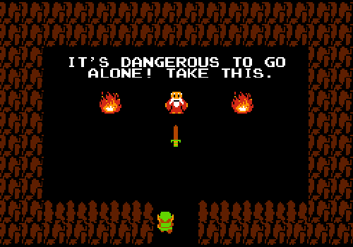

  
  <h1>
    Hi there, I'm Wilson
    
  </h1>
  

    CS Student by day, homelab tinkerer by night, Legend of Zelda enthusiast always.
  

  

    
    
  

---

  
  <h2>🗡️ Current Quests & Adventures 🗡️</h2>

* ⚔️ **Guild Affiliations**: Currently a **Lead Developer** at SBU Campus Residences, formerly an Intern at Epic Systems.
* 🛠️ **Class**: Developer/DevOps Hybrid (multiclassing is OP).
* 💬 **Skills Unlocked**: JavaScript/TypeScript, Python, React, C\#, and Java.
* 🔭 **Main Quest**: Building a 3D course prerequisite visualizer for my university.
* 🏠 **Side Quest**: Maintaining my homelab stronghold, running instanced Minecraft worlds and a lore wiki, all protected by a Cloudflare Tunnel ward.
* 🤝 **Seeking a New Quest**: Looking for New Grad Software Engineering & DevOps opportunities.
* 📜 **Character Sheet**: My full portfolio is currently being forged by the blacksmiths. (Coming soon!)
* ⚡ **Epic Achievement**: Led a party of developers in high school to create a full-stack **[osu\!mania clone](https://uso-mania.netlify.app/home)**.
<!-- * 📜 **Character Sheet**: Explore my projects in more detail at **LINK**. -->

<!-- --- -->

<!-- ### 📊 My GitHub Stats

  
  

  

 -->